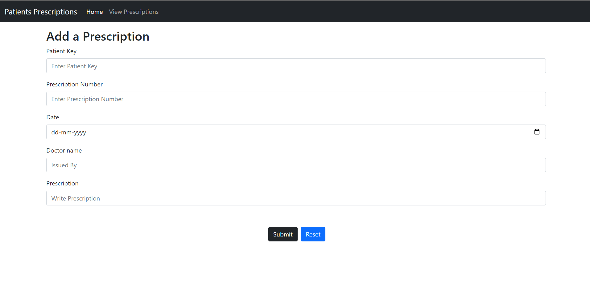
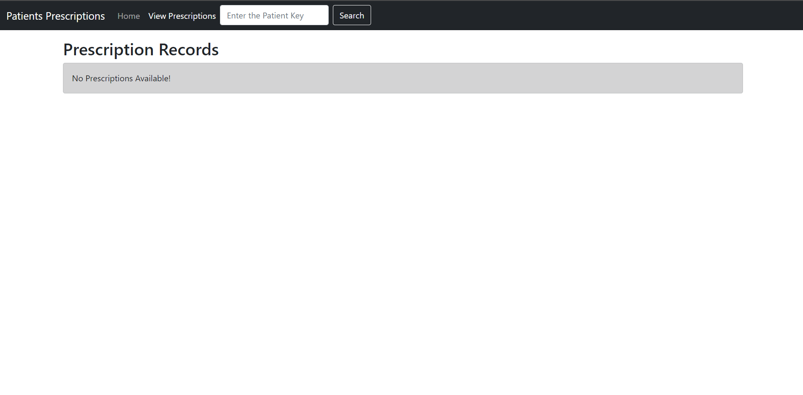
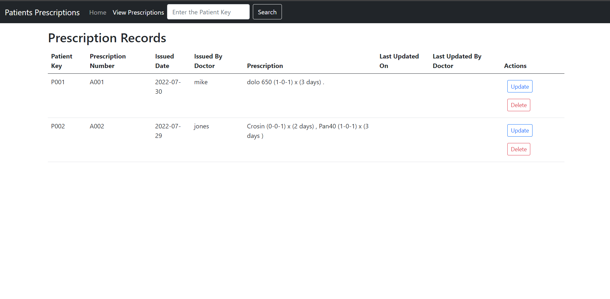
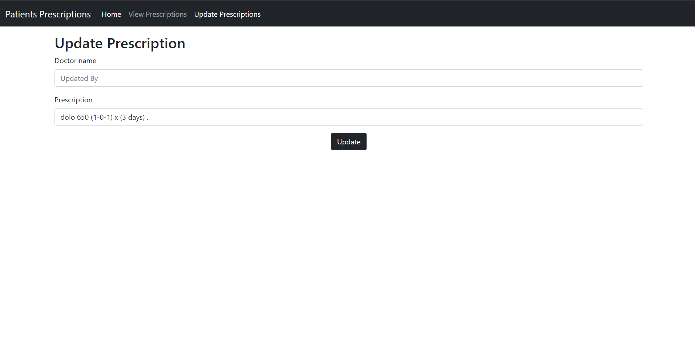
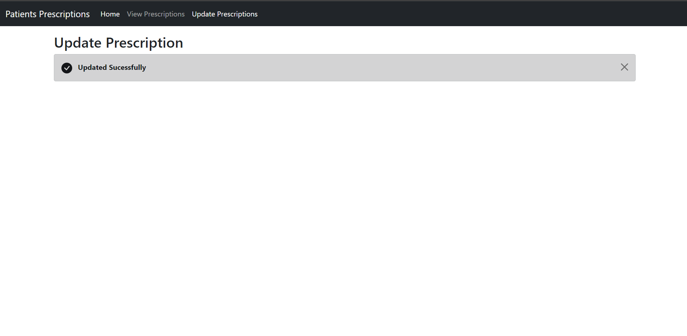
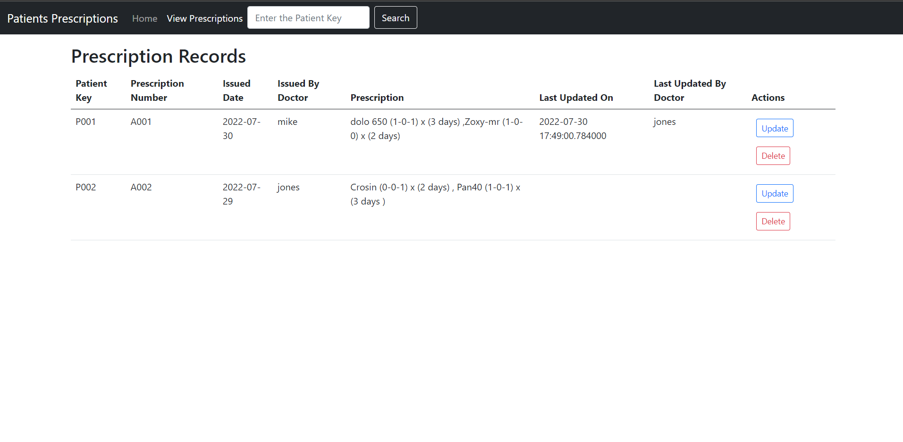
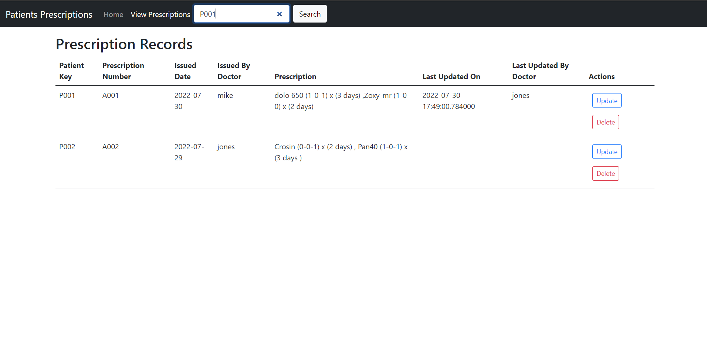
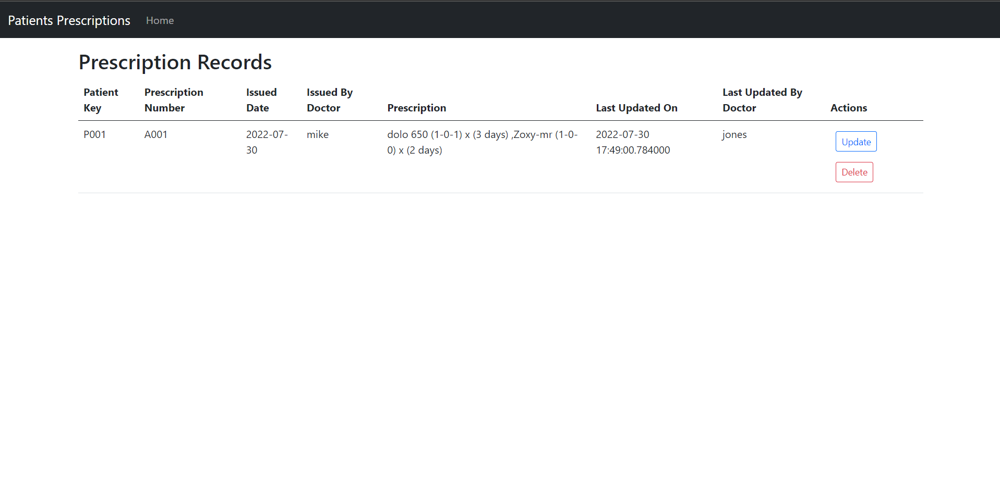

# CRUD-Operations-Using-Mongodb-And-Flask
The Project Demonstrates the working of CRUD-Operations Using mongodb as the database and Flask is used for Web Development

### Requirements :   
1.python  
2.flask  
3.mongodb  
4.html  
5.css  

Install mongodb community edition  
mongodb compass can be used used as GUI to interact or visualize the database 

### Abstract :   
* The idea implemented is the doctor addding/giving Prescriptions to the Patient.  
* The prescriptions can also be deleted or updated.  
* The name of the doctor and time appears that last updated the Prescription record. 
* The Prescription records can be viewed. 
* The prescription records can be searched Using the Patient Key for specific Patients Among all the other records.  

### link to the deployement :  
https://crud-mongdb.herokuapp.com/

### Screenshots:   

  

  

  

 

  

  

  

  

